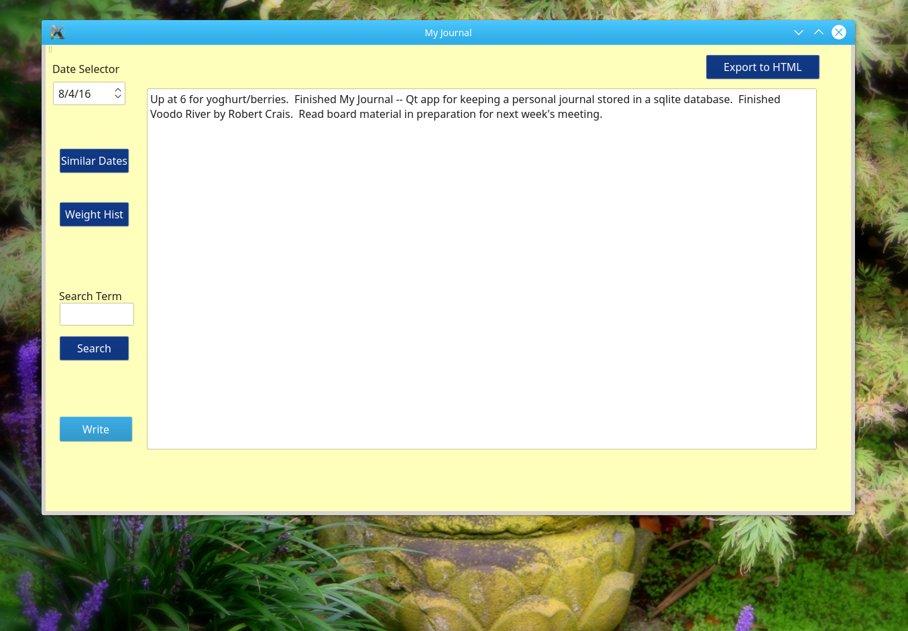
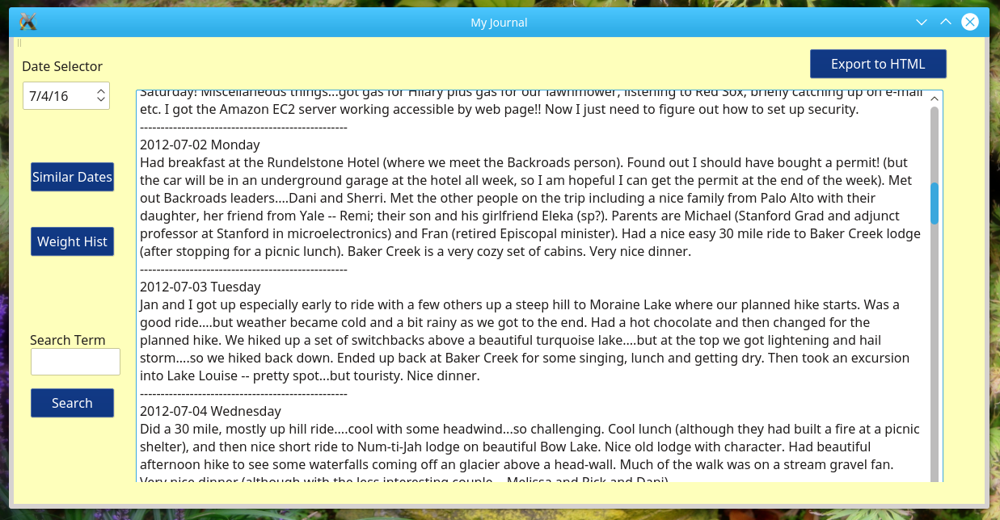
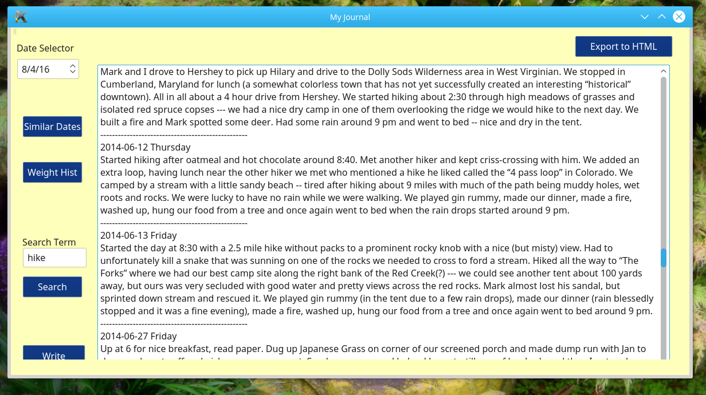
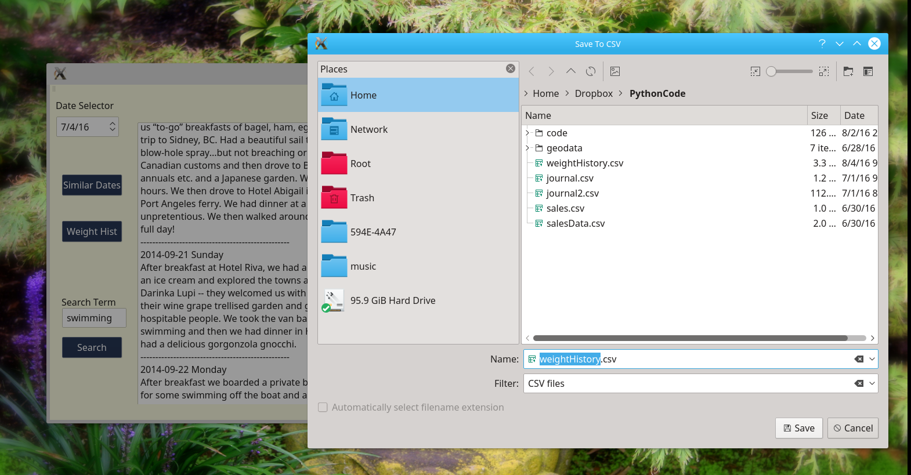

# journalQT #

### Introduction
journalQT is a Qt Project that provides a GUI front end to add, read, and query personal
journal entries stored in a sqlite database.

### Features
* Write or revise your journal entry in the large text box.
* Entries are added or revised when you press the write button.
* Changing the date in the date selector moves to an existing or new entry corresponding
to that date.

* You can see all of your entries from the same time of the year (i.e., what were you doing
last August, or the year before that)

* You can search your journal for all entries with the search term.

* If you record your weight in your journal like weight = 174 or 'My weight was 174 this morning',
the Weight Hist button will create a list of dates and weights.  It will display it and save it
to a csv file.

 
### Dependencies
The class requires an existing [Sqlite](https://www.sqlite.org/about.html) database. The name of
the database does not matter, but it needs a table "journal" with the columns indicated below.
You can create it with sqlite:
* sqlite3 journalSqlite.sqlite
* sqilte> CREATE TABLE journal(ID, Date, Month, Day, Year, DayOfWeek, Entry);
* sqlite> .quit

When you run journalQT it will ask for the location of your database, but then remember
it from then on.

### TODO

### License
MIT License

Copyright (c) 2016 Hugh Whelan

Permission is hereby granted, free of charge, to any person obtaining a copy
of this software and associated documentation files (the "Software"), to deal
in the Software without restriction, including without limitation the rights
to use, copy, modify, merge, publish, distribute, sublicense, and/or sell
copies of the Software, and to permit persons to whom the Software is
furnished to do so, subject to the following conditions:

The above copyright notice and this permission notice shall be included in all
copies or substantial portions of the Software.

THE SOFTWARE IS PROVIDED "AS IS", WITHOUT WARRANTY OF ANY KIND, EXPRESS OR
IMPLIED, INCLUDING BUT NOT LIMITED TO THE WARRANTIES OF MERCHANTABILITY,
FITNESS FOR A PARTICULAR PURPOSE AND NONINFRINGEMENT. IN NO EVENT SHALL THE
AUTHORS OR COPYRIGHT HOLDERS BE LIABLE FOR ANY CLAIM, DAMAGES OR OTHER
LIABILITY, WHETHER IN AN ACTION OF CONTRACT, TORT OR OTHERWISE, ARISING FROM,
OUT OF OR IN CONNECTION WITH THE SOFTWARE OR THE USE OR OTHER DEALINGS IN THE
SOFTWARE.

